# D.E.C.K — Design, Engineering, Concept Kit

A desktop app that turns a project idea into a complete specification deck — requirements, architecture, epics, user stories, and design canvas — powered by AI.

## What it does

You describe an idea. D.E.C.K. uses AI to generate:

- **Requirements document** — functional and non-functional requirements
- **Project scope** — in/out-of-scope items and assumptions
- **Architecture** — component breakdown and technical decisions
- **Project plan** — tasks, deliverables and milestones
- **Epics & user stories** — with acceptance criteria and BDD scenarios (Given/When/Then)

  Everything is stored locally via IndexedDB — no cloud account required.

## How it works

### 1. Empty project list

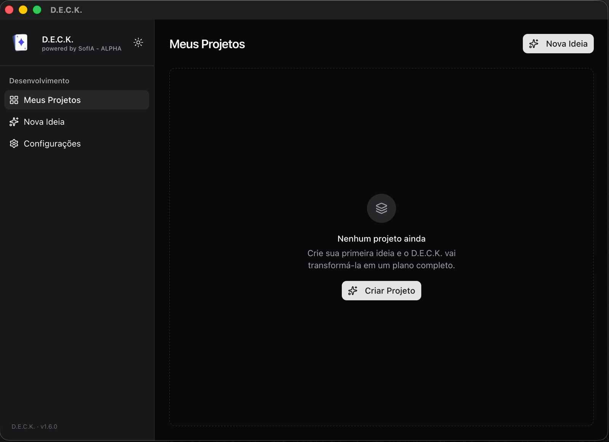

Initial state of the app. The "My Projects" screen shows an empty state prompting the user to create their first project.

---

### 2. Project creation

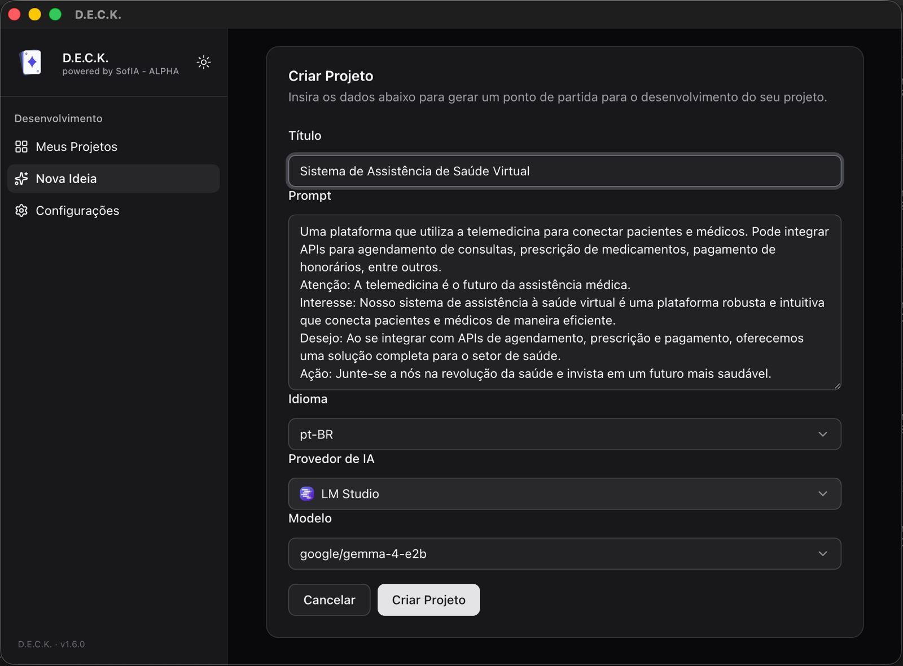

Project creation form. The user provides:

- **Title** — project name
- **Prompt** — free-form description of the idea (no format restrictions)
- **Language** — output language for all generated artifacts (e.g. `pt-BR`, `en-US`)
- **AI Provider** — provider to use for generation (OpenAI, Anthropic, OpenRouter, Ollama, LM Studio)
- **Model** — specific model from the selected provider

---

### 3. API key settings

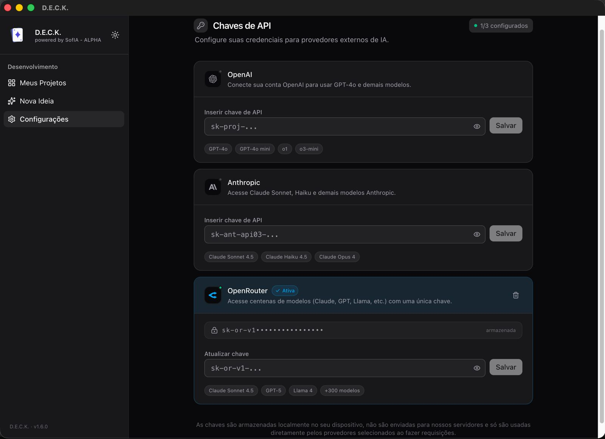

Global settings panel. Each AI provider requires its own API key. Keys are stored locally and encrypted via Electron's `safeStorage` — never sent to external servers. In the example, OpenRouter is active with a configured key.

---

### 4. Generation in progress

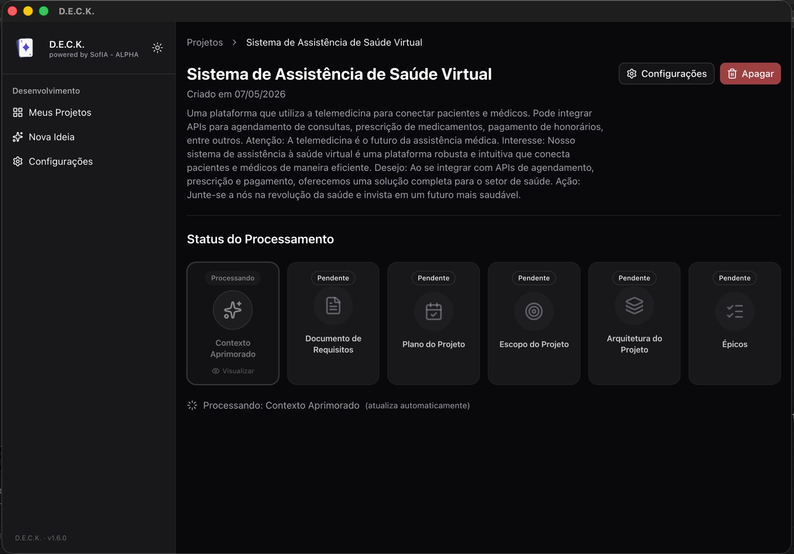

Project dashboard during artifact generation. Artifacts are processed sequentially, the screen updates automatically as each one completes:

1. Enhanced Context *(processing)*
2. Requirements Document *(pending)*
3. Project Plan *(pending)*
4. Project Scope *(pending)*
5. Project Architecture *(pending)*
6. Epics *(pending)*

---

### 5. Generation complete

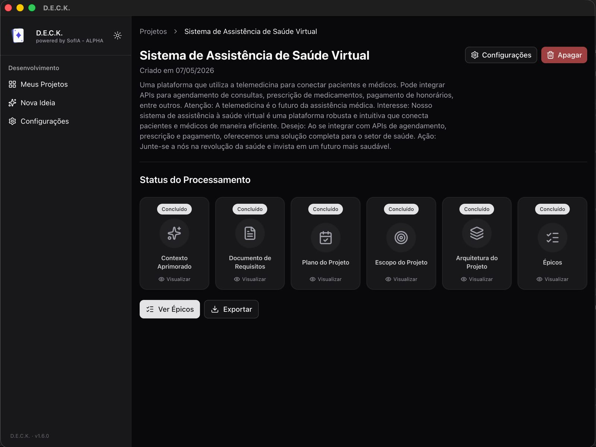

All artifacts generated successfully. Each card shows a **Done** badge and a **View** link. The **View Epics** and **Export** buttons become available once processing finishes.

---

### 6. Partial generation failure

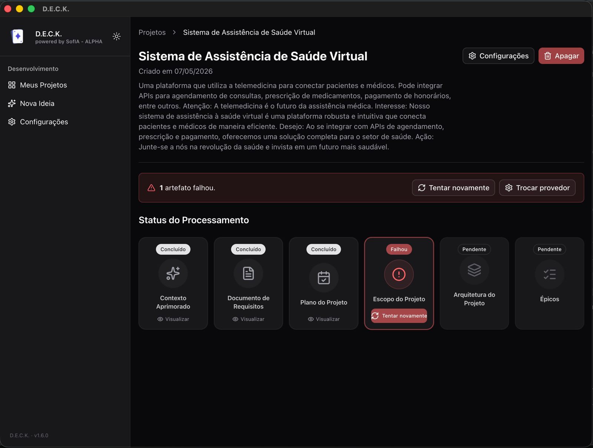

Partial failure scenario: the **Project Scope** artifact failed. The alert banner shows how many artifacts failed and offers two recovery actions — **Retry** (reprocesses with the same provider) and **Switch provider** (opens project settings).

---

### 7. Project settings — switching provider/model

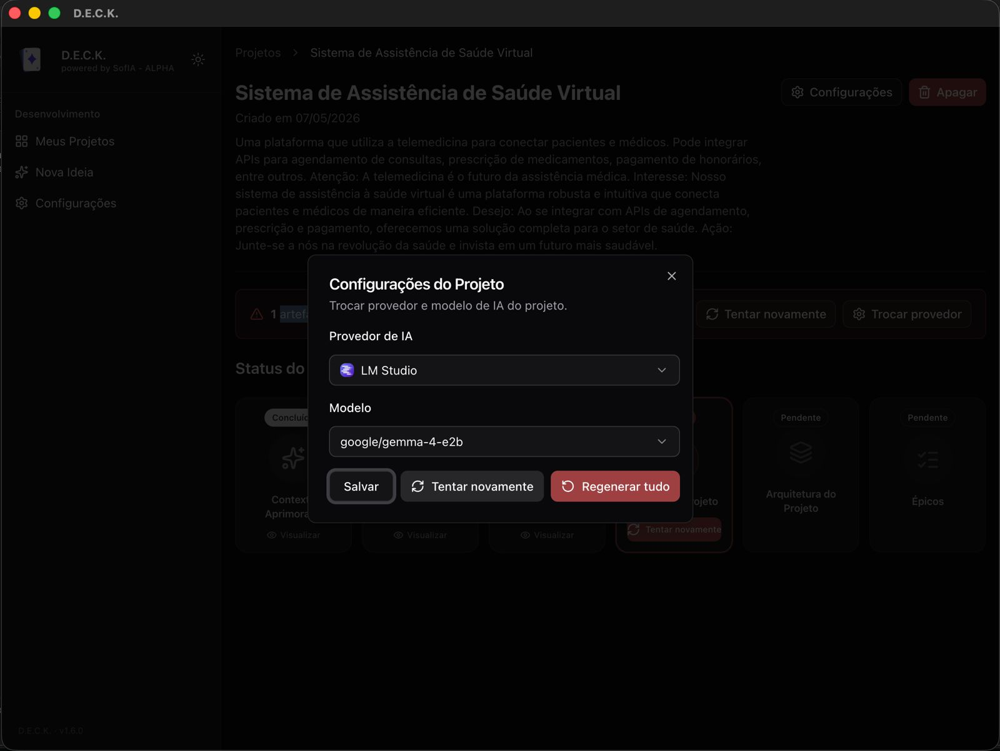

Per-project settings modal, accessible at any time. Lets the user swap provider and model without leaving the project. Available actions:

- **Save** — persist the new configuration for future generations
- **Retry** — reprocess failed artifacts with the new provider
- **Regenerate all** — discard all artifacts and restart generation from scratch

---

### 8. Artifact view — Requirements Document

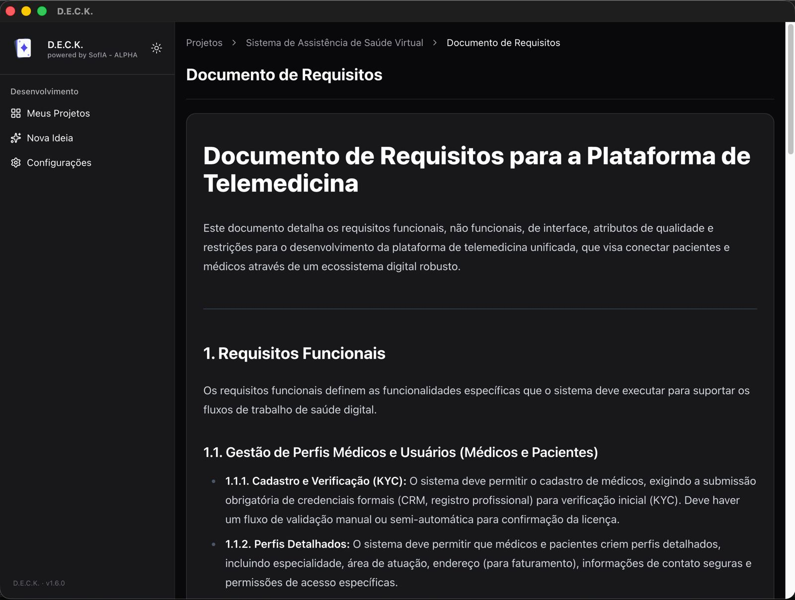

Requirements Document artifact view. Content is generated in Markdown and rendered in the UI. The example shows functional requirements grouped by theme (e.g. profile management, clinical workflows), each with detailed acceptance criteria.

---

### 9. Epic list

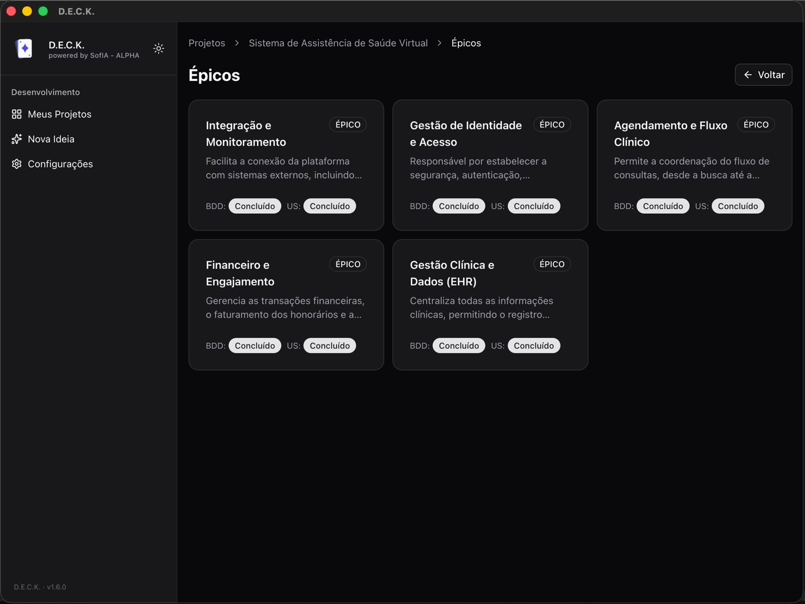

Overview of all generated epics. Each card shows the epic name, a short description, and the generation status of its User Stories and BDD scenarios. The example produced 5 epics:

- Integration & Monitoring
- Identity & Access Management
- Clinical Scheduling Flow
- Financial & Engagement
- Clinical Data Management (EHR)

---

### 10. Epic detail — User Stories

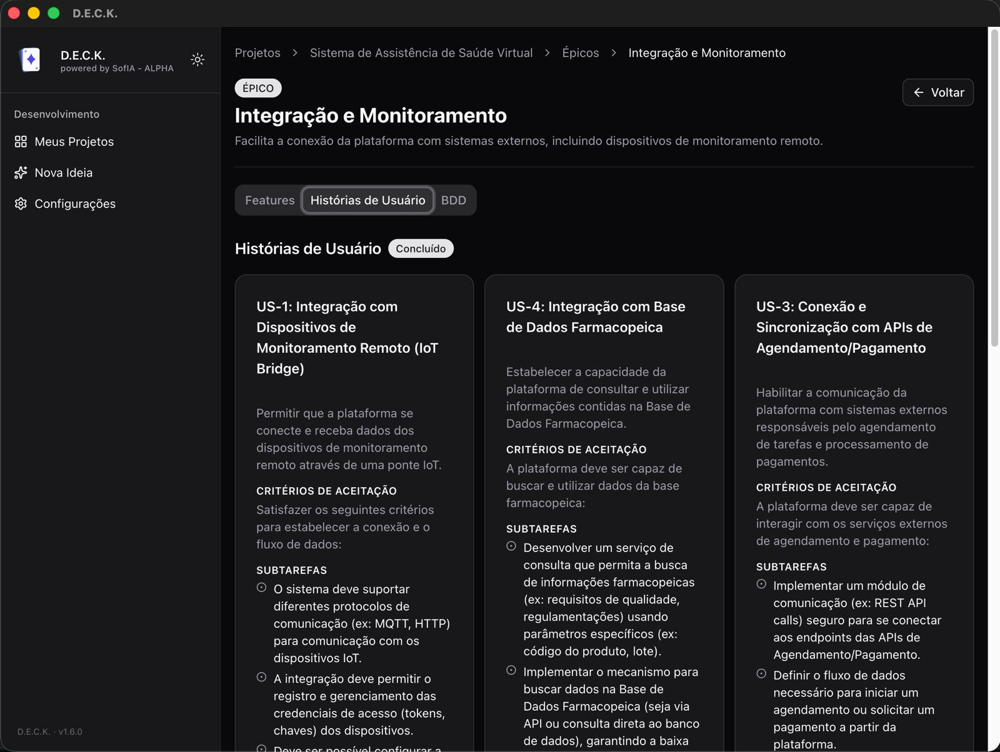

Epic detail with the **User Stories** tab active. Each story includes a title, description, acceptance criteria, and subtasks. The example shows the *Integration & Monitoring* epic with stories covering IoT device integration and scheduling/payment API connections.

---

### 11. Epic detail — BDD scenarios

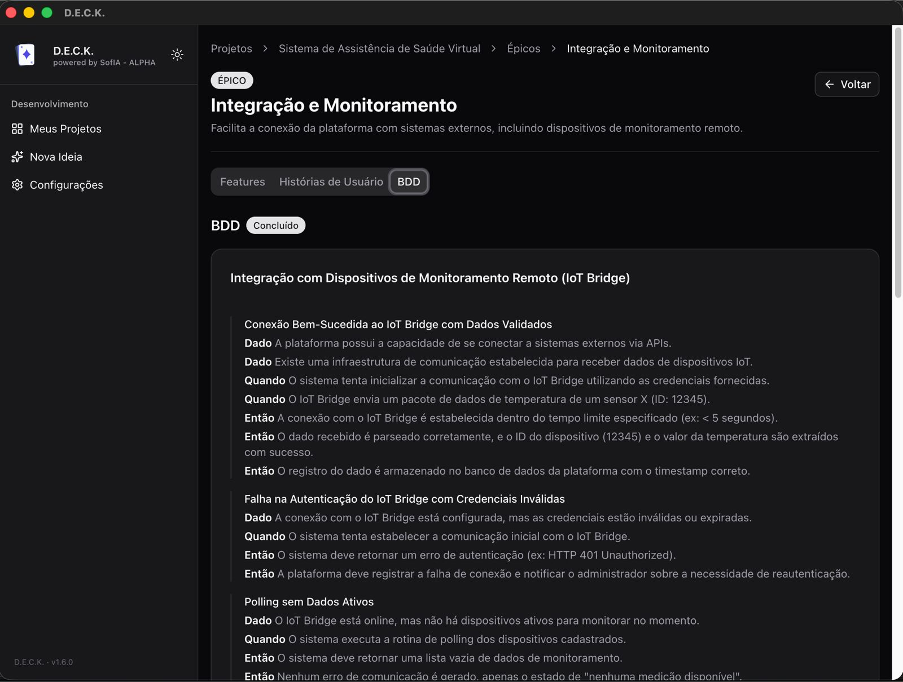

Same epic detail with the **BDD** tab active. Given/When/Then scenarios are generated for each story, covering both happy paths and failure cases. The example shows scenarios for IoT Bridge integration: successful connection, invalid credentials, and polling with no active devices.

### 12. Video

https://github.com/user-attachments/assets/ff221b8b-78ce-4632-ad83-bd39543690d3

## Supported AI providers

| Provider   | Models                     |
| ---------- | -------------------------- |
| OpenAI     | GPT-4o, o1, o3-mini        |
| Anthropic  | Claude Opus, Sonnet, Haiku |
| OpenRouter | Any model                  |
| Ollama     | Any local model            |
| LM Studio  | Any local model            |

Bring your own API key. Keys are encrypted with the OS keychain via Electron's `safeStorage`.

## Download

Pre-built binaries are available on the [Releases](https://github.com/tklsn/deck/releases) page.

| Platform      | File               |
| ------------- | ------------------ |
| Linux         | `.AppImage`        |
| macOS         | `.dmg`             |
| Windows x64   | `-Setup.exe`       |
| Windows ARM64 | `-arm64-Setup.exe` |

The app checks for updates automatically on startup and notifies you when a new version is available.

> **macOS note:** The app is currently unsigned. On first launch, right-click the `.app` and choose **Open** to bypass the Gatekeeper warning.

## Development

**Requirements:** Node 24, pnpm 10

```bash
pnpm install
pnpm run electron:dev   # dev mode with hot-reload
```

**Build for production:**

```bash
pnpm run build          # packages for the current platform
```

**Release a new version:**

```bash
pnpm run release        # bumps version, generates changelog, pushes tag
```

Pushing a tag triggers the CI workflow which builds and publishes binaries for all three platforms to GitHub Releases automatically.

## Tech stack

- [Electron](https://www.electronjs.org/) — desktop shell
- [Vue 3](https://vuejs.org/) + [TypeScript](https://www.typescriptlang.org/) + [Vite](https://vite.dev/)
- [Tailwind CSS v4](https://tailwindcss.com/) + [shadcn-vue](https://www.shadcn-vue.com/)
- [Dexie.js](https://dexie.org/) — local IndexedDB storage
- [electron-updater](https://www.electron.build/auto-update) — auto-updates via GitHub Releases

---

Built with ❤️ by The Koala Solution 🐨 in 🇧🇷
